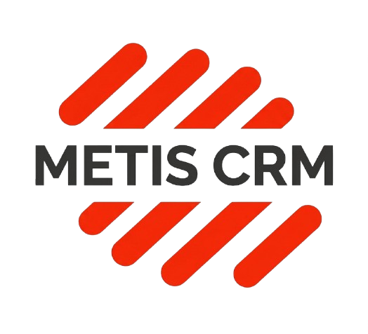

<p align="center">
    <a href="https://metiscrm.com">
        <picture>
            <source media="(prefers-color-scheme: dark)" height="100" srcset="packages/Webkul/Admin/src/Resources/assets/images/dark-logo.png">
            <source media="(prefers-color-scheme: light)" height="100" srcset="packages/Webkul/Admin/src/Resources/assets/images/logo.png">
            
        </picture>
    </a>
</p>

<p align="center">
<a href="https://packagist.org/packages/metis/laravel-crm"></a>
<a href="https://packagist.org/packages/metis/laravel-crm"></a>
<a href="https://packagist.org/packages/metis/laravel-crm"></a>
</p>


## Topics

1. [Introduction](#introduction)
2. [Documentation](#documentation)
3. [Requirements](#requirements)
4. [Installation & Configuration](#installation-and-configuration)
4. [Docker Installation](https://devdocs.metiscrm.com/2.0/introduction/docker.html)
5. [Metis Cloud System](#metis-cloud-system)
6. [License](#license)
7. [Security Vulnerabilities](#security-vulnerabilities)

### Introduction

[Metis CRM](https://metiscrm.com) is a hand tailored CRM framework built on some of the hottest opensource technologies
such as [Laravel](https://laravel.com) (a [PHP](https://secure.php.net/) framework) and [Vue.js](https://vuejs.org)
a progressive Javascript framework.

**Free & Opensource Laravel CRM solution for SMEs and Enterprises for complete customer lifecycle management.**

**Read our documentation: [Metis CRM Docs](https://devdocs.metiscrm.com/)**

**We also have a forum for any type of concerns, feature requests, or discussions. Please visit: [Metis CRM Forums](https://forums.metiscrm.com/)**

# Visit our live [Demo](https://demo.metiscrm.com)

<a href="javascript:void();">
    
</a>

It packs in lots of features that will allow your E-Commerce business to scale in no time:

-   Descriptive and Simple Admin Panel.
-   Admin Dashboard.
-   Custom Attributes.
-   Built on Modular Approach.
-   Email parsing via Sendgrid.
-   Check out [these features and more](https://metiscrm.com/features/).

**For Developers**:
Take advantage of two of the hottest frameworks used in this project -- Laravel and Vue.js -- both of which have been used in Metis CRM.

### Documentation

#### Metis Documentation [https://devdocs.metiscrm.com](https://devdocs.metiscrm.com)

### Requirements

-   **SERVER**: Apache 2 or NGINX.
-   **RAM**: 3 GB or higher.
-   **PHP**: 8.3 or higher
-   **Composer**: 2.5 or higher
-   **For MySQL users**: 8.0.32 or higher.

### Installation and Configuration

#### Prerequisites

- PHP 8.3+
- Composer 2.5+
- MySQL 8.0.32+ / MariaDB
- Node.js 18+ & npm
- Apache 2 / NGINX

#### Step-by-step

```bash
# 1. Clone the repository
git clone <your-repo-url> metis-crm
cd metis-crm

# 2. Install PHP dependencies
composer install --no-dev

# 3. Configure environment
cp .env.example .env
# Edit .env: set APP_URL, DB_*, MAIL_* credentials

# 4. Build admin assets
cd packages/Webkul/Admin
npm install && npm run build
cd ../..

# 5. Run the installer
php artisan metis-crm:install

# 6. Clear cache
php artisan route:clear
php artisan config:clear

# 7. Start development server
php artisan serve

# (Optional) For production:
# composer install --no-dev --optimize-autoloader
# php artisan optimize
```

#### Login

Navigate to `http://localhost:8000/admin/login`

```
Email:    admin@example.com
Password: admin123
```

### Metis Cloud Hosting

[Metis CRM Cloud Hosting](https://metiscrm.com/crm-cloud-hosting) is a fully managed hosting solution where our team sets up, secures, and configures your Metis CRM on reliable infrastructure.

Get a ready-to-use CRM on your own domain, without manual installation or infrastructure complexity, and focus on growing your business while we handle the technology.


### Metis CRM Multi Tenant SaaS

[Metis CRM Multi Tenant SaaS](https://metiscrm.com/extensions/metis-crm-multi-tenant-saas-extension/) Metis Multitenant SaaS is a Laravel-based CRM solution that allows multiple businesses (tenants) to use a single application instance while keeping their data isolated and secure.


### WhatsApp CRM Integration

[Metis CRM WhatsApp](https://metiscrm.com/extensions/metis-crm-whatsapp-extension/) Extension enables the store administrator to generate leads via their WhatsApp number.


### VoIP CRM Integration

[Metis CRM VoIP](https://metiscrm.com/extensions/metis-crm-voip/) extension allows the user to make Trunk calls over a broadband Internet connection and the user can also perform Inbound routes.


### License

Metis CRM is a fully open-source CRM framework which will always be free under the [MIT License](https://github.com/metis/laravel-crm/blob/2.1/LICENSE).

### Security Vulnerabilities

Please don't disclose security vulnerabilities publicly. If you find any security vulnerability in Metis CRM then please email us: sales@metiscrm.com.
